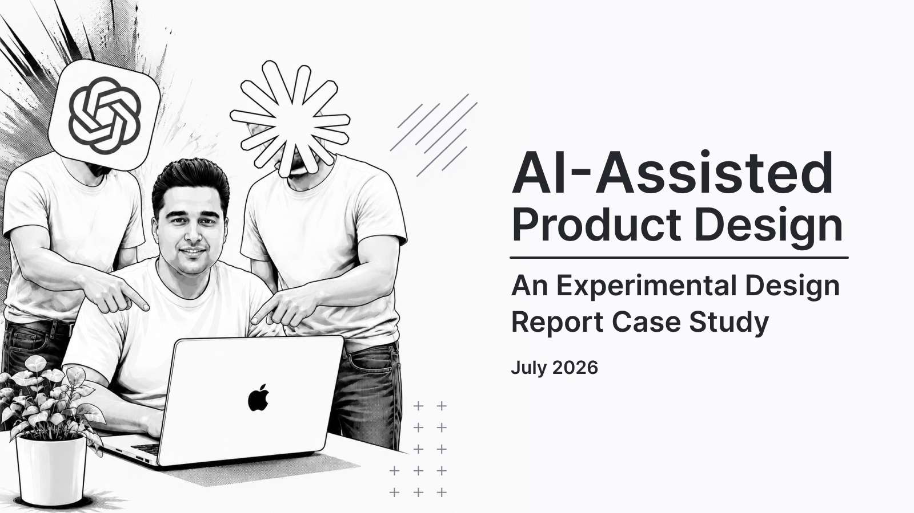

# VaultFlow
### AI-Assisted Product Design Case Study



> An end-to-end product design case study exploring how AI can collaborate in UX research, product strategy, and interface design.

---

## 📖 About

VaultFlow is a conceptual fintech application designed to help users automatically track personal expenses through bank SMS messages.

Unlike a traditional case study, this project documents an end-to-end design process where AI models (ChatGPT, Claude, and Gemini) actively participated in research, ideation, prioritization, UX strategy, and UI design.

The goal wasn't to replace human judgment, but to explore how AI can become a strategic design partner.

---

## 🎯 Project Goals

- Explore AI-assisted Product Design
- Combine Real World Signal Mining with Synthetic User Research
- Build research-driven personas
- Prioritize features using the RICE framework
- Design a scalable Design System
- Create complete UX Flows & UI
- Evaluate the collaboration between Human × AI

---

## 📂 Repository Structure

```
.
├── assets/
│   └── VaultFlow-Cover.jpg
│
├── case-study/
│   └── VaultFlow-Case-Study-Fa.jpg
│
├── design/
│   ├── Assets.pdf
│   ├── Wireframes.pdf
│   ├── UI-Design.jpg
│
└── research/
    ├── ChatGPT Research
    ├── Claude Research
    ├── Gemini Research
    └── AI-Assisted UX Research Prompt
```

---

## 🔬 Research

The research combines two complementary approaches:

- Real World Signal Mining
- Synthetic User Research

Outputs include:

- Affinity Mapping
- Personas
- User Insights
- Feature Prioritization
- Product Requirements

---

## 🎨 Design

The design process includes:

- Product Strategy
- Information Architecture
- Sitemap
- User Flows
- Wireframes
- Design System
- UI Design

---

## 🤖 AI Collaboration

This project documents collaboration with multiple AI models:

- ChatGPT
- Claude
- Gemini

AI contributed to:

- Research
- Analysis
- Product Strategy
- Naming
- UX
- UI Design
- Documentation

Human judgment remained responsible for every final design decision.

---

## 📑 Full Case Study

The complete report is available inside the **case-study** folder.

---

## 📄 Research Documents

All research reports and supporting documents can be found in the **research** folder.

---

## 📬 Feedback

This repository contains the prototype version of the project.

Feedback, critiques, and discussions are highly appreciated.
